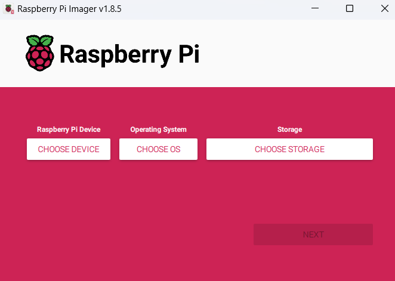
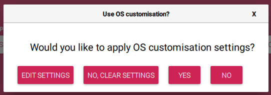
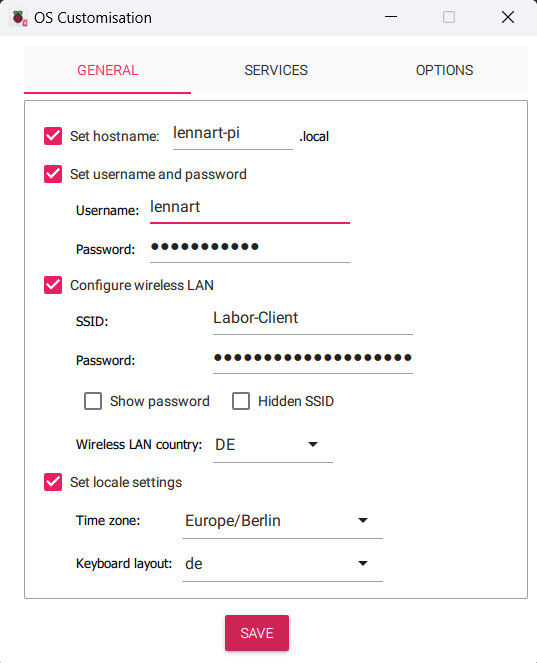
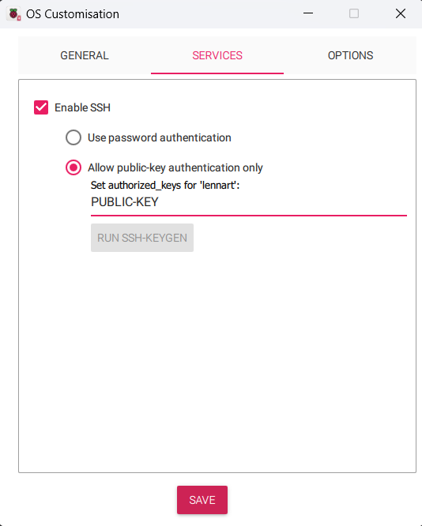
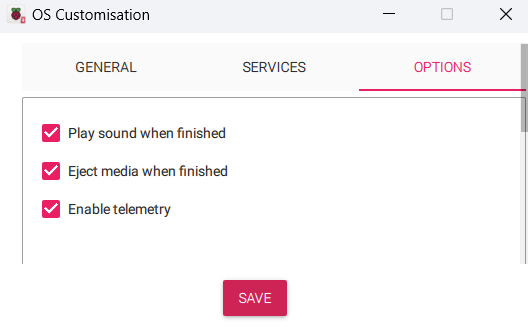

# Einrichtung eines Rasberry Pi

## Prerequisites
- Raspberry Pi
- Raspberry Pi Imager
- SD-Card/USB-Stick

## Aufgabe 1
### Schritt 1
Über den Raspberry Pi Imager wurde die erste initiale Konfiguration vorgenommen.\
Wenn wir den Imager öffnen erhalten wir folgende Ansicht:

Dort stellen wir folgende Dinge ein:\
Device: Raspberry Pi 3\
OS: Raspberry Pi OS Lite\
Storage: SD Card

\
Anschließend drücken wir auf `Next`.

Folgendes Fenster öffnet sich nun:\
\
Dort klicken wir jetzt auf `Edit Settings`.

Nun öffnet sich ein neues Fenster, in welchem wir folgende Informationen eintragen:\
\
Hostname: `lennart-pi.local`\
Username: `lennart` (frei wählbar)\
Password: `********`(Wir melden uns später über unseren SSH-Key an und deaktivieren den Passwort-Login, kann daher leer bleiben)\
WLAN: in unserem Fall `Labor-Client` & Passwort (ggf. ein bei euch verfügbares WLAN)\
Locale Settings: `Europe/Berlin`\
Keyboard layout: `de` (In meinem Fall de, weil QUERTZ Layout, wenn das nicht gesetzt wird dann ist es später nervig die Tastatur zu nutzen)

Nun geht es in den nächsten Tab, Services:\
\
Dort wählen wir den zweiten Punkt\
`[] Allow public-key authentication only`

In das Feld darunter kopiert ihr euren Public Key.\
(Diesen findet ihr unter `~/.ssh/ssh-ed25519.pub` bzw. ggf. als `id_rsa.pub` falls ihr noch RSA Schlüssel nutzt.)

Anschließend können wir im dritten Tab noch alle drei Haken setzen.
Das ist jedoch optional und nicht erforderlich.\


Nun klicken wir auf `Save` um die Einstellungen zu speichern.\
Anschließend schließt sich das Fenster wieder und wir landen wieder im vorherigen Menü:


Dort klicken wir jetzt auf `Yes` und der Imager schreibt nun unser Raspberry OS auf unsere SD-Karte.\
Sobald das fertig ist, wird das Gerät ausgeworfen und wir können es in den Raspberry Pi einstecken und diesen an den Strom anschließen.

### Schritt 2
Verbindung via. SSH testen, dafür nutzen wir das zuvor konfigurierte Gerät.
Wir haben als Hostname `lennart-pi.local` festgelegt und als nutzer `lennart`.
Das ganze sieht dann folgendermaßen aus:
```
PS C:\Users\l.loesche> ssh lennart@lennart-pi.local
```
Anschließend werden wir (sofern festgelegt) nach der Passphrase von unserem SSH Key gefragt.
Diesen geben wir nun ein und anschließend haben wir erfolgreich eine SSH Verbindung zu unserem Rasberry Pi aufgebaut.
```
PS C:\Users\l.loesche> ssh lennart@lennart-pi.local
Enter passphrase for key 'C:\Users\l.loesche/.ssh/id_ed25519':
Linux lennart-pi 6.1.21-v8+ #1642 SMP PREEMPT Mon Apr  3 17:24:16 BST 2023 aarch64

The programs included with the Debian GNU/Linux system are free software;
the exact distribution terms for each program are described in the
individual files in /usr/share/doc/*/copyright.

Debian GNU/Linux comes with ABSOLUTELY NO WARRANTY, to the extent
permitted by applicable law.
Last login: Thu Feb 29 13:52:21 2024 from fe80::be30:f564:9b59:5375%wlan0
lennart@lennart-pi:~ $
```

## Aufgabe 2
Nun wollen wir, dass der Raspberry Pi in den Schul-Hotspot kommt.
Dieser ist ein WLAN-Netzwerk, welches über einen Radius Server geschützt ist.
Die Herausforderung ist also unsere Zugangsdaten auf dem Pi gehasht zu hinterlegen.
Unsere aktuelle Konfiguration nach der Installation sieht folgendermaßen aus:
```
lennart@lennart-pi:~ $ sudo cat /etc/wpa_supplicant/wpa_supplicant.conf
ctrl_interface=DIR=/var/run/wpa_supplicant GROUP=netdev
update_config=1

network={
        ssid="Labor-Client"
        psk=578abce8e3f9a9a00cb37328f78a7166a5017d077a4dcd480074887318649231
}
```

Diese wollen wir jetzt anpassen bzw. erweitern.\
Wir nutzen dafür den `nano` command, dieser lautet dann `sudo nano /etc/wpa_supplicant/wpa_supplicant.conf` und dort ergänzen wir folgende Zeilen:\
```
network={
    ssid="YourSSID"
    key_mgmt=WPA-EAP
    eap=PEAP
    identity="YourUsername"
    password="YourPassword"
    phase2="auth=MSCHAPV2"
}
```

Neben dem zweiten Block ergänzen wir noch `priority` damit es einen Fallback auf die erste Option bzw. SSID gibt.\
Unsere Datei sieht am Ende also folgendermaßen aus:
```
ctrl_interface=DIR=/var/run/wpa_supplicant GROUP=netdev
update_config=1

network={
        ssid="Labor-Client"
        psk=578abce8e3f9a9a00cb37328f78a7166a5017d077a4dcd480074887318649231
        priority=2
}

network={
        ssid="Schul-Hotspot"
        proto=RSN
        key_mgmt=WPA-EAP
        pairwise=CCMP
        auth_alg=OPEN
        eap=PEAP
        identity="lennart213"
        password="*****"
        phase1="peaplabel=0"
        phase2="auth=MSCHAPV2"
        priority=1
}
```